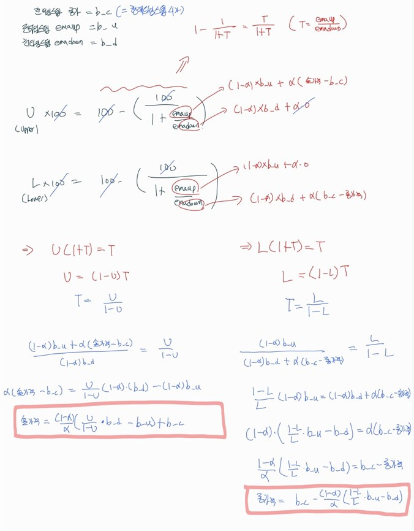

## Table of Contents
- [내 기준 백테스팅시 기본 고려 사항](#1)
- [파라미터 튜닝 방법](#2)
- [골든크로스 데드크로스 이용 백테스팅](#3)
- [마틴게일 베팅법을 응용한 매매 방법](#4)
- [역추세 매매 전략](#5)
- [일목균형 구름대를 활용한 매매 방법](#6)
- [RSI를 이용한 매매 방법](#7)

---

## #1

### 내 기준 백테스팅시 주의 사항

- 이동평균선이나 여러 지표들을 계산할때는 현재 타임스텝의 종가에 따라 지표들의 값들이 실시간으로 변화함 -> 백테스팅을 구현할시에 현재 타임스텝의 저가에서부터 고가까지 값들이 변화하는데 그 값들에 따라 지표들의 값들을 매번 계산하고 하면 정확한 타점을 계산하기가 번거로움

- 따라서 여러 지표들을 게산할때는 전 타임스텝까지의 값을 이용하여 계산하고, 현재 타임스텝의 저가에서부터 고가까지 모두 고려해 내가 원하는 특정 값을 넘어사는 타이밍이 있다면 그 가격에 매수 또는 매도하도록 설정

- 또한 실시간 매매할때는 현재 타임스텝에서의 종가가 계속해서 변화하므로 내가 원하는 지점을 여러번 터치해서 매수 매도가 반복적으로 수행될수가 있음. 백테스팅에서는 저가에서부터 고가까지 내가 원하는 가격이 몇번 왔다갔다 했는지 틱데이터가 아니라면 정확하게 알수가 없음 -> 따라서 실시간 매매할때도 그 타임스텝에서 내가 원하는 가격에 한번 도달하면 그 타임스텝에서는 매수매도를 잠깐 쉬고 다음 타임스텝에서 매수매도를 하도록 설정하기(백테스팅과 최대한 유사하게 설정하기 위함)

- 하지만 위와 같이 설정하게 된다면 한 타임스텝의 가격 변동폭이 클경우 매수 매도 조건을 동시에 만족할 경우가 발생하게 되는데 무조건 먼저 존재하는것 먼저 체결하고 그 타임스텝은 매수매도 쉴것. 백테스팅에서는 이와 같은 경우 어떤것이 먼저오는지 알수가 없음 같은 타임스텝이라면 저가 고가만 나오기때문에 어떤것이 먼저 도달한지 알수 없음. 따라서 이럴경우 백테스팅에서는 매수만 먼저하는걸로 설정. 이 경우는 백테스팅과 실매매의 어쩔수 없는 차이라고 생각하기

- 매매조건에 따라서 1분봉같은 경우는 조건을 만족하는 경우가 연속적으로 생성될수가 있음. 이럴 경우 1분단위로 한번 open 하면 n분 동안은 open은 하지 못하게 하는 방법등을 설정해둘수 있음. 이 n 또한 tuning 으로 설정하는 값

- 여러번 매수매도를 진행하는 경우는 확실한 매도를 할때 매수를 한 포지션을 모두 정리하는것이 아니라면 각각의 포지션마다 익절라인 손절라인을 정해놓고 스탑로스와 익절선을 걸어놨다고 생각하고 매수매도 (백테스팅을 구현할때는 최대 매수매도 개수를 정해놓고 매수 매도 한 포지션마다 익절라인이나 손절라인에 도달했는지 체크해보기)(여기서도 백테스팅의 단점이 들어나는데 만약에 타임스텝이 긴시간으로 측정된다면 익절라인과 손절라인이 한 타임스텝에 동시에 존재할수 있음 이럴때는 보수적으로 하고싶다면 백테스팅시에 같은 타임스텝에서는 손절부터 처리하고 조금 가능성을 더 열어두고 싶다면 익절먼저 처리하기)

- 상승장,하락장,횡보장을 구분할수 있는 명확한 기준을 만들고 매매법칙을 만들면 성과가 더 좋게 나올것. 하지만 이것을 정확하게 구분한다는것은 쉽지 않음 -> 알고리즘에 맞게 튜닝을 해줘야함

- 숏과 롱에서의 수익과 손실 퍼센트를 잘 알아야함.
    - 숏 포지션에서의 최대 수익률은 레버리지를 쓰지 않는 이상 최대 100%임.(곧 레버리지를 사용하지 않더라도 주가가 2배이상 상승하면 숏포지션은 청산될수가 있음)
    - 반대로 말하면 롱 포지션에서 레버리지를 쓰지 않는 이상 청산당할일은 절대 없음 주가가 100% 이상 하락할수가 없기 때문

- BTC/USDT 5분봉에서 2021년 7월 26일 10:00 데이터를 보게 되면 시가는 36736 인데 high가 48168까지 엄청나게 올랐다가 종가는 38926 에서 마무리되는 1개의 봉이 존재. 제일 무거운 비트코인인데 약 12000원, 즉 약 30프로 정도 5분봉에서 한번에 상승한것을 확인 할수 있음.(이 부분까지도 대응할수 있는 매매방법 생각해보기)

---

## #2

### 파라미터 튜닝 방법
- 그리드 서치 : 범위를 정해 놓고 그 범위 안에서 랜덤 선택하는 것
    - 따로 라이브러리 없이 그냥 단순하게 random를 통해서 값을 찾아나가는 것. 마지막에 리스트에 결과를 모두 넣고 최대를 나타내는것을 찾으면 됨
    - 다소 오래걸리긴 하지만 반복횟수가 많아진다면 결과가 거의 정확하게 나오게 됨
    - 코드
        ```python
        import random

        # x가 2일때 y가 1일때 최댓값 1을 가지는 함수 예시
        def black_box_function(config):
            x = config['x']
            y = config['y']
            return -(x-2) ** 2 - (y - 1) ** 2 + 1

        # random.uniform(a,b) a<= x <= b (실수)
        # random.randint(a,b) a<= x <= b (정수)
        # random.choice(리스트) 리스트안에 원소중 랜덤하게 하나 선택

        def random_select():
            config_data ={
                'x':random.uniform(2,4),
                'y':random.uniform(-3,3)
            }
            
            return config_data

        results = []

        for i in range(2000):
            config_data = random_select() # 함수로 실행시켜야 매번 값이 변경됨
            answer = black_box_function(config_data)
            
            results.append([config_data,answer])

        results.sort(key=lambda x:-x[1])
        print(results[0])
        '''
        [{'x': 2.047482821245402, 'y': 0.9867631591040436}, 0.9975701677296723]
        '''
        ```
- 베이지안 최적화 : 베이지안 확률 개념(가설을 세우고 실제로 실행해서 가설을 검증하고 개선해나가는 것)을 바탕으로 범위 안에서 조금 더 빠르게 파라미터를 찾아나가는 방법
    - 설치 
        - `!pip install bayesian-optimization`
        - `conda install -c conda-forge bayesian-optimization`
    - 코드
        ```python
        from bayes_opt import BayesianOptimization

         # x가 2일때 y가 1일때 최댓값 1을 가지는 함수 예시
        def black_box_function(x, y):
            return -(x-2) ** 2 - (y - 1) ** 2 + 1
        pbounds = {'x':(2,4),'y':(-3,3)}
        # 2<=x<=4 , -3<=y<=3 양쪽 둘다 포함.
        optimizer = BayesianOptimization(
            f = black_box_function,
            pbounds = pbounds,
            random_state = 1
        )

        optimizer.maximize(
            init_points=5, # 처음에 랜덤하게 도는 횟수
            n_iter=20, # 베이지안 확률 기반으로 반복 횟수
        )
        '''
        |   iter    |  target   |     x     |     y     |
        -------------------------------------------------
        | 1         | -7.135    | 2.834     | 1.322     |
        | 2         | -7.78     | 2.0       | -1.186    |
        | 3         | -16.13    | 2.294     | -2.446    |
        | 4         | -8.341    | 2.373     | -0.9266   |
        | 5         | -7.392    | 2.794     | 0.2329    |
        | 6         | -15.02    | 4.0       | 0.8624    |
        | 7         | -3.799    | 2.184     | 0.83      |
        | 8         | -5.343    | 2.0       | 2.531     |
        | 9         | -14.29    | 3.36      | 3.0       |
        | 10        | -3.363    | 2.0       | 1.603     |
        | 11        | -3.873    | 2.0       | 0.06544   |
        | 12        | -3.012    | 2.0       | 1.108     |
        | 13        | -3.072    | 2.0       | 0.7319    |
        | 14        | -3.003    | 2.0       | 0.9458    |
        | 15        | -3.0      | 2.0       | 1.006     |
        | 16        | -3.0      | 2.0       | 1.003     |
        | 17        | -3.0      | 2.0       | 1.002     |
        | 18        | -3.0      | 2.0       | 1.002     |
        | 19        | -3.002    | 2.0       | 0.9547    |
        | 20        | -3.0      | 2.0       | 1.02      |
        | 21        | -3.0      | 2.0       | 1.016     |
        | 22        | -3.0      | 2.0       | 1.013     |
        | 23        | -3.001    | 2.0       | 0.9613    |
        | 24        | -3.0      | 2.0       | 1.017     |
        | 25        | -3.0      | 2.0       | 1.014     |
        =================================================
        '''
        ```
        ```python
        target_list = []

        for res in enumerate(optimizer.res):
            target_list.append(res)
            
        target_list.sort(key=lambda x:x[1]['target'],reverse=True)    
        print(target_list[0])
        '''
        (23, {'target': 0.9999568202951842, 'params': {'x': 2.0, 'y': 1.0065711266017168}})
        '''
        # 첫번째 23은 23번째 반복에서 나온 결과값이라는 뜻
        ```
    - 실전 코드 예시
        ```python
        def run_test(config):
            balance = 300    #잔고
            balance_rate = 1 #잔고 사용 비율, 2이면 2배 레버리지 사용

            trade_fee = 0.001      #거래수수료
            revenue_rate   = config['revenue_rate']    #익절 비율(Tunning)
            max_loss_rate  = config['max_loss_rate']   #손절 비율(Tunning)
            open_cnt_limit = config['open_cnt_limit']  #최대 오픈 건수(Tunning)

            set_wma_s  = list_wma_s [int(round(config['wma_s'],0))] # 소수점에서 찾기때문에 인트로 변경시켜줘서 사용하면 됨
            ##### 생략 ####
            ###############
            return revenue # maximize 하고 싶은 값을 return 해야함
        ```
        ```python
        def black_box_function(revenue_rate, max_loss_rate, open_cnt_limit, wma_s, wma_l, wma_ss, wma_ll,
                      ll_bl_inc_rate_dec, ll_max_loss_rate_dec, ll_revenue_rate_dec, ll_balance_rate_dec
                      ):
            config_data = {
                'revenue_rate'  : revenue_rate,
                'max_loss_rate' : max_loss_rate,
                'open_cnt_limit' : open_cnt_limit,
                'wma_s'  : wma_s,
                'wma_l'  : wma_l,
                'wma_ss' : wma_ss,
                'wma_ll' : wma_ll,
                'll_bl_inc_rate_dec' : ll_bl_inc_rate_dec, 
                'll_max_loss_rate_dec' : ll_max_loss_rate_dec, 
                'll_revenue_rate_dec' : ll_revenue_rate_dec, 
                'll_balance_rate_dec' : ll_balance_rate_dec
            }
            revenue = run_test(config_data)
            return revenue

        pbounds = {
            'revenue_rate':  (0.003,0.1),
            'max_loss_rate': (0.003,0.1),
            'open_cnt_limit':(3,15), 
            'wma_s': (0,3), 
            'wma_l': (0,3), 
            'wma_ss':(0,3), 
            'wma_ll':(0,3),
            'll_bl_inc_rate_dec' :   (0.2, 1), 
            'll_max_loss_rate_dec' : (0.2, 1), 
            'll_revenue_rate_dec' :  (0.2, 1), 
            'll_balance_rate_dec' :  (0.2, 1) 
        }

        optimizer = BayesianOptimization(
            f=black_box_function,
            pbounds=pbounds,
            random_state=1
        )

        #실행
        optimizer.maximize(
            init_points=10,
            n_iter=100
        )
        ```
- optuna
    - https://github.com/kyungmin1212/Data_Science/blob/main/study/etc.md#1 참고
    - 다양한 알고리즘을 통해 최적화 방법을 제공
    - 예시 코드 : https://github.com/kyungmin1212/Trading/blob/main/code/rev_trend_backtest_1m.ipynb

#### References
- https://github.com/fmfn/BayesianOptimization/blob/master/examples/advanced-tour.ipynb
---

## #3

### 골든크로스 데드크로스 이용 백테스팅
- 타임프레임 : 분봉,일봉
- 매매 기법 : 골든크로스,데드크로스
- 사용 지표 : 이동평균선
- 변수의 수 : 2개
    - 중기 추세 : 50 이동평균선
    - 장기 추세 : 200 이동평균선
- 매수 규칙
    - 매수 신호
        - 중기 추세 > 장기 추세
    - 매수 시점
        - 매수 신호가 발생한 15분봉 다음봉이 생성될때 바로 매수
    - 매도 시점
        - 이익이나 손실에 관계없이 중기 추세 < 장기 추세가 된다면 매도
- 매도 규칙
    - 매도 신호
        - 중기 추세 < 장기 추세
    - 매도 시점
        - 매도 신호가 발생한 15분봉 다음봉이 생성될때 바로 매도
    - 매수 시점
        - 이익이나 손실에 관계없이 중기 추세 > 장기 추세가 된다면 매도

- 코드
    - https://github.com/kyungmin1212/Trading/blob/main/code/ma_backtest.ipynb

- 결과
    - 상승이나 하락의 방향성이 결정되어져 있을 경우는 이득을 봄
    - 하지만 횡보장에서는 중기 추세선과 장기 추세선의 크로스가 나타나는 경우가 빈번하여 추세를 따라가서 수익을 크게 본다기 보다는 오르면 바로 하락하고 내리면 바로 상승하는 경우가 많아 손해가 점점 커짐
    - 이평선 거래만으로는 횡보장에서 손해를 보게 됨. 단, 상승추세나 하락추세가 결정되어져 있다면 쓸만한 전략

---

## #4

### 마틴게일 베팅법을 응용한 매매방법
- 질때마다 2배의 금액으로 배팅을 하면 결국에는 언젠가는 따게된다는 방법
- 돈만 많다면 무조건적으로 수익을 볼 수있는 방법
- 하지만 수익률이 그렇게 좋지는 않음.
- BTC/USDT 기준 first_open_coin_amount = 0.00001 로 포지션을 처음 open 한다고 가정했을때 2020년부터 수익률은 총 60.76755633142815usdt (0.5프로 오르면 매도, 3프로 내리면 추가 매수)
- 코드
    - https://github.com/kyungmin1212/Trading/blob/main/code/martingale_backtest.ipynb
- 결론
    - 무한히 매수를 할수는 없지만 일정 추가매수를 계속하게 된다면 돈을 딸 확률이 더 높아짐
---

## #5

### 역추세 매매 전략

- 타임프레임 : 분봉
- 매매 기법 
    - 상승 추세에서 현재가가 VWAP 기준 이격도 n%이하로 하락한다면 롱 포지션 오픈
    - 반대로 하락 추세에서 현재가가 VWAP 기준 이격도 n%이상으로 상승한다면 숏 포지션 오픈. 
    - 포지션 클로즈는 일정 수익이 나면 익절, 일정 손실이 나면 손절 처리
    - 상승 추세, 하락 추세 판별은 WMA 사용(WMA가 가장 민감하기 때문에 WMA 를 사용함)
- 양방향 매매 설정(Hedge Mode)
- 사용 지표 : VWAP,WMA
- 변수의 수 : 8개
    - VWAP : n 주기
    - 중기 추세 WMA : n 주기
    - 장기 추세 WMA : n 주기
    - 이격도 : n %
    - 익절 퍼센트 : n %
    - 손절 퍼센트 : n %
    - 최대 포지션 open 개수 : n개
    - 연속 구매 제한 횟수 : n번 

- 매수(롱) 규칙
    - 매수 신호
        - (전 타임스텝의 중기 추세 WMA > 전 타임스텝의 장기 추세 WMA) & (전 타임스텝의 VWAP기준 이격도 n% 이하)
    - 매수 시점
        - 매수 신호가 발생한 지점에서 바로 매수
    - 매도 시점
        - 익절 : 구매 가격으로부터 익절 퍼센트가 되면 익절
        - 손절 : 구매 가격으로부터 손절 퍼센트가 되면 손절
- 매도(숏) 규칙
    - 매도 신호
        - (전 타임스텝의 중기 추세 WMA < 전 타임스텝의 장기 추세 WMA) & (전 타임스텝의 VWAP기준 이격도 n% 이상)
    - 매도 시점
        - 매도 신호가 발생한 지점에서 바로 매도
    - 매도 시점
        - 익절 : 구매 가격으로부터 익절 퍼센트가 되면 익절
        - 손절 : 구매 가격으로부터 손절 퍼센트가 되면 손절

- 코드
    - https://github.com/kyungmin1212/Trading/blob/main/code/rev_trend_backtest_1m.ipynb

- 결론
    - optuna를 통해 최적화 파라미터를 찾으면 큰 상승과 하락이 있는 장('BTCUSDT_1m_2021-03-03-00-00-00_2022-05-01-23_59_00')에서는 우상향적으로 수익을 내는 성공적인 결과가 나옴 (약 1년동안 80% 수익 발생)
            
        - 1000usdt 시작 기준 -> revenue:825.8381415726429 open_tot_cnt:1827 (전체 데이터는 약 600000건, 약 3000분에 1 포지션 오픈)
    - 하지만 최적화된 결과를 바탕으로 횡보하는 장(또는 변동성이 작은 장)(BTCUSDT_1m_2022-06-01-00-00-00_2022-12-31-23_59_00)에서는 거래수도 많이 줄어들고 수익률도 약 6개월간 -3프로 정도 손실 발생
            
        - 1000usdt 시작 기준 -> revenue:-27.735264085701285 open_tot_cnt:608 (전체 데이터는 약 300000건, 약 5000분에 1 포지션 오픈)
    - 일정 수익률과 일정 손실률이 정해져 있는 경우는 가격 변동폭에 클때와 작을때에 따라 너무 극명하게 차이가 발생함. 따라서 일정 수익률과 일정 손실률을 정해두기 보다는 특정 지표를 기준으로 매수 매도를 진행하는 방법을 찾으면 더 좋을것 같음.

---
## #6

### 일목균형 구름대를 활용한 매매 방법
- 타임프레임 : 5분봉
- 매매 기법 
    - 일목 균형 구름대를 이용한 매매
- 양방향 매매 설정(Hedge Mode)
- 사용 지표 : 일목균형표
- 변수의 수 : 3개
    - window 1 (low period)
    - window 2 (medium period)
    - window 3 (high period)

- 매수(롱) 규칙
    - 매수 신호
        - 전 타임스텝까지의 flag가 구름 아래에 있다가 이번 타임스텝에서의 종가가 구름 위에 있을 경우
    - 매수 시점
        - 종가를 기준으로 매수 신호가 발생하면 바로 그 종가에 매수
    - 매도 시점
        - 익절 손절 모두 동일 : 현재 타임스텝의 종가가 구름 아래로 내려갈경우 포지션 종료
- 매도(숏) 규칙
    - 매도 신호
        - 전 타임스텝까지의 flag가 구름 위에 있다가 이번 타임스텝에서의 종가가 구름 아래에 있을 경우
    - 매도 시점
        - 종가를 기준으로 매도 신호가 발생하면 바로 그 종가에 매도
    - 매수 시점
        - 익절 손절 모두 동일 : 현재 타임스텝의 종가가 구름 위로 올라갈경우 포지션 종료

- 코드
    - https://github.com/kyungmin1212/Trading/blob/main/code/ichimoku_backtest.ipynb

- 결과
    - 상당히 빈번한 매매로 인하여 수수료로 거의다 손실을 봄
    - 수수료가 0.04% 인데 슬리피지를 고려하여 0.05% , 포지션 오픈 클로즈를 모두 고려하면 한번 오픈 클로즈할때마다 0.1%의 수수료 발생 따라서 전액을 모두 사용하여 매매를 한다고 가정했을때 balance 대비 수수료를 제외한다면 0.999가 계속해서 남게될텐데 복리로 인하여 1000번만 거래해도 0.999^(1000)=0.3676 으로 원금대비 36프로밖에 남아있지 않게 됨
    - 따라서 balance를 전 금액으로 매매를 할 경우 수익없이 무작정 매매를 하게되면 크나큰 손실일 발생하게 됨
    - 최대한 손절 또는 본절을 하지 않는 것이 중요! 
    - 최소한 0.1% 보다는 수익을 내는 매매를 해야함. --> 확실한 매매 타이밍을 잡자.

---

## #7

### RSI를 이용한 매매 방법
- 타임프레임 : 1분봉
- 매매 기법 
    - RSI를 이용하여 RSI 값이 어느정도를 초과하면 숏 오픈 ,어느정도 값 미만이라면 롱 오픈
- 양방향 매매 설정(Hedge Mode)
- 사용 지표 : RSI
- 변수의 수 : 8개
    - RSI Upper Limit
    - RSI Lower Limit
    - RSI period
    - 익절 퍼센트 : n %
    - 손실 퍼센트 : n %
    - 일정 손실 퍼센트에서 추가 포지션 오픈 횟수 : n번
    - 최대 포지션 open 개수 : n개
    - 연속 구매 제한 횟수 : n번 

- 매수(롱) 규칙
    - 매수 신호
        - 현재 타임스텝의 RSI가 RSI Lower Limit 미만이면 매수
    - 매수 시점
        - 현재 타임스텝에서 RSI Lower Limit 미만이 되는 가격에 도달하면 바로 매수
        - 따라서 미리 RSI Lower Limit 미만이 되는 가격을 구해놓아야함
    - 매도 시점
        - 익절 퍼센트가 되면 익절
        - 손실 퍼센트가 되면 최대 n번까지 추가 포지션 오픈을 한 뒤 n+1번째에서 손절
- 매도(숏) 규칙
    - 매도 신호
        - 현재 타임스텝의 RSI가 RSI Upper Limit 초과면 매수
    - 매도 시점
        - 현재 타임스텝에서 RSI Upper Limit 초과가 되는 가격에 도달하면 바로 매도
        - 따라서 미리 RSI Upper Limit 미만이 되는 가격을 구해놓아야함
    - 매수 시점
        - 익절 퍼센트가 되면 익절
        - 손실 퍼센트가 되면 최대 n번까지 추가 포지션 오픈을 한 뒤 n+1번째에서 손절

- rsi upper 지점과 rsi lower 지점 가격 찾기    
        

- 코드
    - https://github.com/kyungmin1212/Trading/blob/main/code/rsi_backtest.ipynb

- 결과
    - 1분봉에서 rsi를 이용하여 테스트를 진행하였는데 횡보장에서는 나름 수익이 나오지만, 하락추세나 상승 추세가 지속이 된다면 계속해서 손실이 많이 쌓여나가는 일이 발생함.
    - 따라서 다른 보조지표들과 결합하여 사용해야할것 같음.

---

## #8

### 볼린저밴드 + RSI를 이용한 매매 방법
- 타임프레임 : 1분봉
- 매매 기법 
    - rsi와 볼린저 밴드를 이용하여 두 신호를 결합하여 최대한 확률을 높인 매매 기법
- 양방향 매매 설정(Hedge Mode)
- 사용 지표 : RSI, Bollinger Band
- 변수의 수 : 8개
    - RSI Upper Limit
    - RSI Lower Limit
    - RSI period
    - Bollinger band period
    - Bollinger band mult
    - 익절 퍼센트 : n % ( 매도 시점을 볼린저 밴드 기준으로 하면 사용안할수 있음)
    - 손실 퍼센트 : n %
    - 일정 손실 퍼센트에서 추가 포지션 오픈 횟수 : n번
    - 최대 포지션 open 개수 : n개
    - 연속 구매 제한 횟수 : n번 

- 매수(롱) 규칙
    - 매수 신호
        - (전 타임스텝에서 종가가 RSI Lower Limit 밑) & (전 타임스텝에서의 종가가 Bollinger Band 하단에 위치)
    - 매수 시점
        - 매수신호가 발생한 현재 타임스템에서 매수
    - 매도 시점
        - 익절 퍼센트가 되면 익절 or 볼린저 밴드 상단 터치시 매수(볼린저 밴드 계산할줄 알아야함)
        - 손실 퍼센트가 되면 최대 n번까지 추가 포지션 오픈을 한 뒤 n+1번째에서 손절
- 매도(숏) 규칙
    - 매도 신호
        - (전 타임스텝에서 종가가 RSI Upper Limit 위) & (전 타임스텝에서의 종가가 Bollinger Band 상단에 위치)
    - 매도 시점
        - 매도신호가 발생한 현재 타임스템에서 매도
    - 매수 시점
        - 익절 퍼센트가 되면 익절 or 볼린저 밴드 하단 터치시 매도(볼린저 밴드 계산할줄 알아야함)
        - 손실 퍼센트가 되면 최대 n번까지 추가 포지션 오픈을 한 뒤 n+1번째에서 손절


- 코드
    - https://github.com/kyungmin1212/Trading/blob/main/code/bollinger_rsi_backtest.ipynb

- 결과
    - 1분봉에서 rsi를 이용하여 테스트를 진행하였는데 횡보장에서는 나름 수익이 나오지만, 하락추세나 상승 추세가 지속이 된다면 RSI만을 이용한 매매 방법처럼 계속해서 손실이 많이 쌓여나가는 일이 발생함.
    - 추가매수방식을 변경하거나, 다른 전략이 필요함
