## Table of Contents

- [단순 이동 평균(SMA : Simple Moving Average)](#1)
- [가중 이동 평균(WMA : Weighted Moving Average)](#2)
- [지수 이동 평균(EMA : Exponential Moving Average)](#3)
- [이동평균 수렴발산(MACD : Moving average convergence divergence)](#4)
- [상대적 강도 지수(RSI : Relative Strength Index)](#5)
- [Fast Stochastic](#6)
- [Slow Stochastic](#7)
- [상대적 강도 스토캐스틱(StochRSI)](#8)
- [Bollinger Bands](#9)
- [VWAP(Volume-Weighted Average Price)](#10)
- [이격도(disparity)](#11)

---
## #1

### 단순 이동 평균(SMA : Simple Moving Average)
- 장기,중기,단기거래 모두 사용 가능
- 매우 우수한 기술적지표
- 다만 주가의 움직임에 다소 늦게 반응한다는 약점 존재(후행성(time lag))
- 5일(1주일), 20일(1달), 60일(3달), 120일(6달), 240(1년) (주식기준)
- 단순 이동 평균의 문제점
    - 지난 n일 가격을 모두 같은 비중으로 다루고 있음
    - 지난 n일 이전 가격을 잘라버림(=즉, 이동평균선의 상승과 하락은 n일전의 가격보다 현재가격이 큰지 작은지에 따름)
- 식    
            
- 매매방법
    - 골든크로스가 나타나면 매입, 데드크로스가 나타나면 매도
    - 또는 이동평균선을 지지선 또는 저항선으로 이용하여 매매하는 방법도 존재
    - 정배열일경우 상승장이라고 판단

#### References
- http://www.yes24.com/Product/Goods/72299568

---

## #2

### 가중 이동 평균(WMA : Weighted Moving Average)
- 단순 이동 평균선의 첫번째 문제점인 n일 가격을 모두 같은 비중으로 다룬다는것을 해결하기 위해 나온 이동 평균
- 최근의 주가에 가중치를 두어 계산
- 단순이동평균에 비해 최근의 시장 분위기를 잘 반영한다는 장점이 있음
- 단순 이동 평균과 같이 5일, 20일, 60일, 120일, 240일 등의 가중이동평균이 사용됨
- 가중 이동 평균의 문제점
    - 지난 n일 이전 가격을 잘라버림
- 식    
    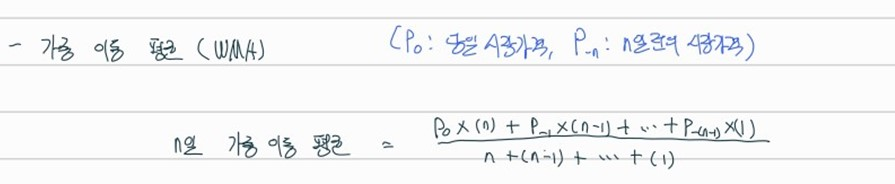    
- 매매방법
    - 단순 이동 평균과 동일

#### References
- http://www.yes24.com/Product/Goods/72299568

---

## #3

### 지수 이동 평균(EMA : Exponential Moving Average)
- 단순 이동 평균과 가중 이동 평균의 단점을 보완한 형태
- 식
    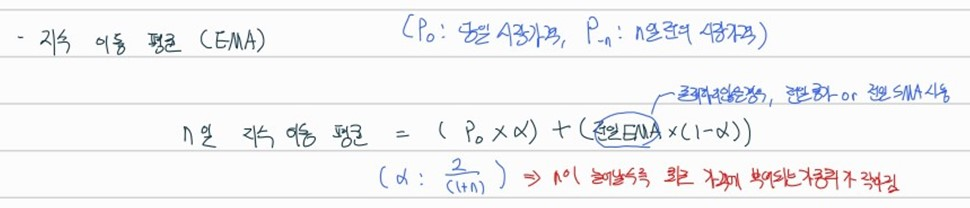    
- 매매방법
    - 단순 이동 평균과 동일

#### References
- https://www.cmegroup.com/ko/education/learn-about-trading/courses/technical-analysis/understanding-moving-averages.html
---

## #4

### 이동평균 수렴발산(MACD : Moving average convergence divergence)
- 장기,단기거래 모두 사용 가능
- 이동평균의 장점은 그대로 살리면서 동시에 이동평균의 약점인 후행성은 상당 부분 보강
- 지수이동평균이 서로 만나는 수렴(Convergence)현상과 멀어지는 발산(Divergence)현상을 이용 
- MACD는 두 이동평균선의 차이를 의미
- 식
    - MACD Line : Fast 지수이동평균 - Slow 지수이동평균 (ex. Fast: 12, Slow : 26)
    - Signal Line : MACD Line Sign 지수이동평균 (ex. Sign : 9)
    - Diff Line : MACD Line - Signal Line    
    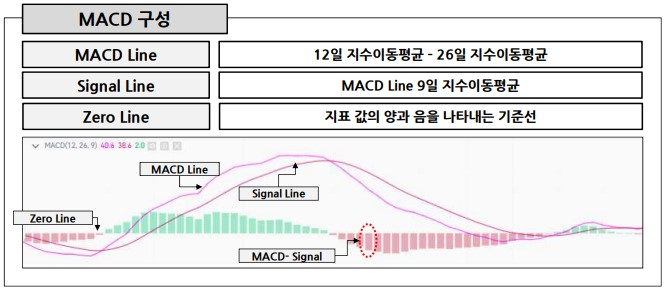    
- 매매방법
    - MACD곡선이 시그널곡선을 무너뜨리고 하락하거나 MACD가 시그널곡선을 뚫고 위로 치솟을 때가 추세가 바뀌는 시점(따라서 매매 타이밍은 MACD와 시그널곡선이 서로 교차하는 시기)
    - MACD 곡선이 시그널 곡선을 상향돌파할 때 매입, MACD 곡선이 시그널 곡선을 하향돌파할 때가 매도
    - 추가적으로 MACD값이 플러스 상태인지 마이너스 상태인지도 고려해야함
    - MACD 값이 플러스면 단기이동평균이 장기이동평균보다 크다는것이므로 현재의 추세가 상승세라는 것
    - 따라서 이런 상황에서 MACD 곡선과 시그널곡선이 서로 교차하여 매도신호를 나타내면, 이것은 MACD가 마이너스 상태일 때 나타내는 매도신호에 비하여 훨씬더 강력
    - 즉, MACD가 플러스일때 매도신호가 발생하였다면 그 이후의 주가가 큰 폭으로 하락하는 경우가 많음
    - 같은 원리로 MACD가 마이너스일 때 나타나는 매입신호는 그렇지 않을 때의 매입신호에 비해 훨씬더 강력(훨씬더 주가가 큰폭으로 상승하는 경우가 많음)

#### References
- http://www.yes24.com/Product/Goods/72299568

---

## #5

### 상대적 강도 지수(RSI : Relative Strength Index)
- 보통 14일 평균 RSI 사용(근래와서는 14일이 너무 길다는 이유로 9일을 사용하는 경우가 많음. 다만 9일 이하의 단기간이 되면 불안정성이 높아지므로 9일 정도가 최소한)
- 식    
    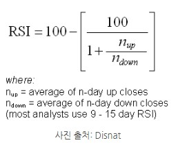    
    - n_up : 어떤 기간 동안에 바로 이전의 봉 대비(일봉 기준으로 보면 전일 종가이고, 1분봉 기준으로 보면 1분 전 기준 종가) 다음 봉이 상승했을 경우, 그 상승 정도를 평균낸 값
    - n_down : 어떤 기간 동안 바로 이전의 봉 대비 다음 봉이 하락했을 경우, 그 하락 정도를 평균낸 값    
    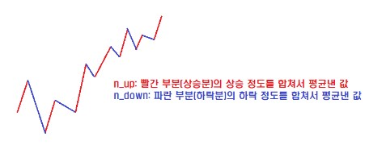    
    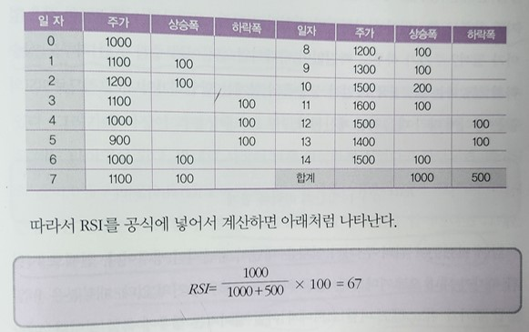    
- 매매방법
    - RSI가 30보다 낮을 때(과매도 상태) 사서 RSI가 70보다 높을 때(과매수 상태) 팔기.
    - 웬만해서는 잘 맞지만 RSI 30 밑에서 샀는데 RSI 가 70위로 가지않고 계속해서 하락한다면 계속 손실을 보게 됨
    - 마찬가지로 RSI가 70위로 올라가자마자 팔았는데 계속 상승세를 유지하면서 훨씬 일찍 매도한 경우가 될수도 있음
    - 이럴 경우를 대비하여 RSI가 단순히 70이상일 때를 매도 타이밍으로 잡는것이 아니라, 70이상이던 RSI가 다시 낮아져서 70아래로 내려서는 순간이 최적 매도 타이밍이 됨. 마찬가지로 30이하에 머무르던 RIS가 상승하기 시작하여 30선을 상향 돌파할때가 최적 매입 타이밍이됨

#### References
- https://contents.premium.naver.com/usa/nasdaq/contents/220417154258594IW

---

## #6

### Fast Stochastic
- 단기 장기거래 모두 사용할 수 있고 특히 단기거래에 유용
- 기술적분석에서 RSI와 기술적지표를 대표하는 양대산맥
- 주식시장의 고점과 바닥을 정확히 포착하는 능력이 탁월
- 과거 일정한 기간 동안(일반적으로 5일을 사용)의 가격 움직임 중에서 오늘의 종가가 어느 위치에 있는가를 파악하는 것이 목적.
- 이것을 이용하여 현재의 추세와 시장상황을 파악
- 식    
    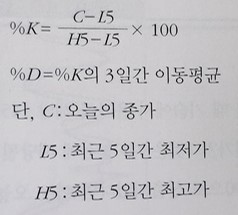    
    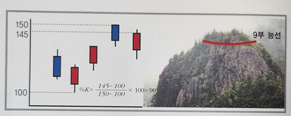    
    - 5일 동안의 최고가에서 최저가를 차감한 수치와 오늘의 종가위치를 서로 비교하는 방식으로 산출
    - K곡선의 3일 이동평균선 D곡선을 하나 더 만듦
- 매매방법
    - 현재의 시장상황이 과열이나 또는 과매도 상태인지 확인을 위해 사용
    - K곡선과 D곡선이 서로 교차할 때를 매매타이밍으로 잡음
    - K곡선이 D곡선을 상향돌파하는 골든크로스가 나타나면 매입 타이밍으로 간주
    - K곡선이 D곡선을 하향 돌파하는 데드크로스가 나오면 매도 타이밍으로 간주
    - K의 값이 과열권을 나타내거나 또는 과매도 상태라면 매매신호의 신뢰도는 더욱 높음
    - 즉, K값이 100가까울때 K곡선이 D곡선을 하향돌파하는 데드크로스가 나타나면 강력한 매도신호이고, K값이 0가까이에서 K곡선이 D곡선을 상향돌파하는 골든크로스가 나타나면 강력한 매입신호

#### References
- http://www.yes24.com/Product/Goods/72299568

---

## #7

### Slow Stochastic
- 단기 장기거래 모두 사용 가능
- 실제로 (Fast) Stochastic을 사용해보면 신호가 너무 자주 나타나서 혼란스럽게됨 그렇기 때문에 Slow Stochastic이 개발됨
- 이 지표는 (Fast) Stochastic의 민감도를 약간 낮추면서 동시에 안정성을 높이기 위하여 개발됨. 최근에는 Fast Stochastic 보다 훨씬 더 많이 사용되고 있음
- Stochastic의 장점인 민감도는 크게 훼손하지 않으면서 안정성을 높이기 위하여 고안된것이 Slow Stochastic임
- 식
    - (Fast) Stochastic 처럼 K곡선과 D곡선을 각각 산출함
    - 여기서 D곡선을 다시 한번 3일간 이동평균 시켜줌. 원래 D곡선은 Slow K곡선이라고 이름을 붙이고 D곡선을 3일 이동평균 시킨 곡선은 Slow D곡선이라는 이름을 붙임
    - 마지막으로 처음의 K곡선을 제거하고 슬로우 K곡선과 슬로우 D곡선을 이용하여 매매 타이밍을 포착함
    - (a일간의 거래범위에서 K산출 - b일간 이동평균을 산출하여 D산출 - D를 c일간 이동평균하여 Slow D산출)  -> (5-3-3)
    - (5-3-3) 말고 좀더 안정성을 높이기 위해 (10-6-6)을 사용하기도 함 (14-7-7)도 사용되기도 함. 산출기간이 길어질수록 안정적으로 바뀌지만 그만큼 민감도는 저하됨
    - 민감도와 안정성은 트레이드 오프 관계
- 매매방법
    - 기존의 (Fast) Stochastic과 동일

#### References
- http://www.yes24.com/Product/Goods/72299568

---

## #8

### 상대적 강도 스토캐스틱(StochRSI)
- Stochastic과 RSI가 서로 결합된 것
- (Fast) Stochastic은 주가 변화에 예민하게 움직이면서 매입, 매도신호를 나타내는데 산출하는 기간이 너무 단기간이라 주가 변화에 민감한 문제 존재. 특히 주가 변화에 너무나 예민한 탓에 종종 잘못된 신호를 나타내는 등 불안정하다는 것이 짖거됨
- 반면에 RSI는 비교적으로 안정적으로 움직임. 하지만 너무 안정적인 탓에 주가 움직임을 즉각 반영하지 못하고 다소 둔하다는 약점이 존대
- 이 둘의 장점을 합쳐 스토캐스틱의 민감성을 살리면서 동시에 RSI 의 안정성을 확보한것이 StochRSI임
- 식
    - Stochastic 산출 방법과 동일. 다만 주가가 들어갈 자리에 그날의 RSI가 들어간다는 것에만 차이가 있음(일반적으로 RSI(9)사용 원래는 14일을 사용했지만 너무 길다는 이유로 9일을 사용하는 경우가 많음. 9일 이하는 단기간이 되면서 불안정성이 높아지므로 9일 정도가 최소한임)    
    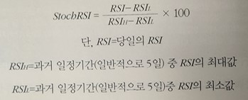    
- 매매방법
    - RSI 매매방법과 동일. 다만 StochRSI에서는 이 기준을 다소 강화하여 80 또는 20선으로 하는 것이 보통
    - 마찬가지로 80이상에서 바로 파는것이 아니라 80선을 하향돌파할때 매도, 반대로 20선을 상향 돌파할때가 매입기회

#### References
- http://www.yes24.com/Product/Goods/72299568

---

## #9

### Bollinger Bands
- 20일 이동평균선을 주로 사용하며, 중기적인 분석에 유효
- 시장이 추세로 움직일 때는 밴드의 지지나 저항을 기대하면 큰 실패를 맛볼수 있음
- 다만 시장이 횡보할 때에는 꽤 효과적이며 추세의 강도를 확인하는 수단으로도 좋음
- 정규분포에서는 평균을 중심으로하여 표준편차의 +/- 1배의 범위 안에 전체의 68.3%가 분포되어 있고, 평균을 중심으로 하여 표준편차의 +/- 2배의 범위 안에 전체의 95.5%가 분포되어 있으며, 평균을 중심으로 하여 +/- 3배의 범위안에는 전체의 99.7%가 분포되어 있음. 이런점을 착안하여 만든것이 볼린저밴드
- 볼린저밴드는 현재의 주가와 이동평균의 간격이 얼마나 되는지에 따라 현재의 시장이 정상적인지 비정상적인 상태인지를 판단하려는 방법
- 식
    - 중간 밴드는 통상 20일 이동평균선이 사용됨(물론 분석가에 따라 다른 기간의 이동평균선 사용가능)
    - 위쪽 밴드는 중간 밴드에다 표준편차 2배를 더한 값, 아래쪽 밴드는 중간 밴드에다 표준편차 2배를 차감한 값
- 매매방법
    - 볼린저밴드의 해석에서 요점은 두가지임
        - 하나는 위쪽 밴드나 아래쪽 밴드가 각각 저항선이나 지지선으로 작용한다는 사실
        - 다른 하나는 밴드의 폭이 좁아졌다 넓어졌다 하는 사실
    - 위쪽 아래쪽 밴드의 기능
        - 위쪽 밴드와 아래쪽 밴드를 중간 밴드에다 각각 표준편차 2배를 더하거나 뺀 값으로 설정한 이유는 앞서 말한 통계학이론에 따른것.
        - 위쪽 밴드를 벗어날 확률은 2.25%, 마찬가지로 아래쪽 밴드를 벗어날 확률도 역시 2.25%에 불과함
        - 따라서 주가가 상승하여 위쪽 밴드에 근접하거나 반대로 하락하여 아래쪽 밴드에 근접한다면 그만큼 현재의 시장은 비정상적인 과열국면이거나 과매도국면으로 해석됨
        - 또한 위쪽 밴드나 아래쪽 밴드가 저항성또는 지지선으로 작용할수 있음
    - 볼린저밴드의 폭
        - 볼린저밴드 폭이 좁아졌다는 것은 표준편차 값이 줄어들었다는 것이기때문에 일정한 기간동안 가격의 변동성이 작았다는 것을 의미함.
        - 따라서 볼린저밴드의 위 아래 밴드 폭이 좁혀들 때, 다시 말하여 오랜 기간동안 가격의 변동성이 줄어들었을 시점이 추세가 전환하는 결정적인 타이밍이 될수 있음
    - 위의 방법을 이용한 실전 매매 방법
        - 위쪽 밴드에 접근할때는 저항성으로 생각하여 매도 타이밍
        - 아래쪽 밴드에 접근할때는 지지선으로 생각하여 매수 타이밍
        - 밴드폭을 생각하여 밴드의 폭이 좁아졌을때 천천히 사서 모았다가 터지길 기다리기(다만, 볼린저밴드로는 변동성이 커질 것은 예측할 수 있어도 방향은 예측 불가)

#### References
- http://www.yes24.com/Product/Goods/72299568

---

## #10

### VWAP(Volume-Weighted Average Price)
- 거래량까지 고려한 지표
- 식    
    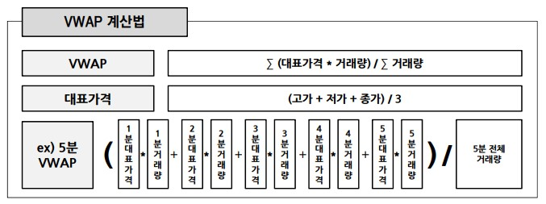    
- 매매방법
    - 가격이 VWAP 위에 있으면 과매수라고 판단(매도)
    - 가격이 VWAP 밑에 있으면 과매도라고 판단(매수)
    - 또는 VWAP 선 자체를 추세선으로 보아서 하락추세인지 상승추세인지 판단가능
    - StochRSI와 결합하여 사용가능함
        - VWAP가 하락추세라면 Stochastic이 골든크로스가 발생하더라도 매수하지않고 데드크로스가 발생할때만 매도하기
        - 아래 예시를 보면 VWAP가 하락 추세이기 때문에 골든 크로스일때는 포지션 오픈을 하지 않았고 데드크로스가 발생했을때 Short 포지션을 오픈함. 그리고 나서 VWAP의 추세와 상관없이 Stochastic이 골든 크로스가 발생했을때 포지션을 close하면 됨.    
        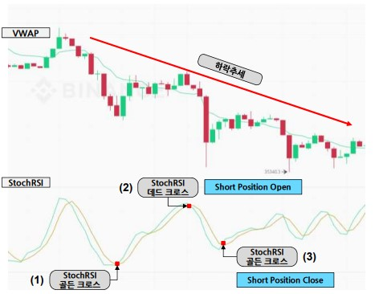    

#### References
- https://www.inflearn.com/course/%EB%B9%84%ED%8A%B8%EC%BD%94%EC%9D%B8-%EC%84%A0%EB%AC%BC-%EC%95%8C%EA%B3%A0%EB%A6%AC%EC%A6%98-%ED%8A%B8%EB%A0%88%EC%9D%B4%EB%94%A9/dashboard

---

## #11

### 이격도(disparity)
- 당일의 가격을 이동평균주가로 나눈 백분율
- 따로 TA Library에서 제공하는 기능이 없음
- 단순하게 종가에서 이동평균을 나누어주고 100을 곱해주면 쉽게 구할수 있음
- 코드
    `df_org['disparity20'] = df_org['close']/df_org['wma20']*100`
- 매매방법
    - 매매방법 1
        - 20일 이격도 기준 95%아래면 매수 신호, 105% 위면 매도 신호
        - 60일 이격도 기준 90%아래면 매수 신호, 110% 위면 매도 신호
        - %는 tunning을 통해 바뀔수도 있음
        - 이격도만으로 매매를 할경우에는 주가가 지속적으로 우하향해서 주가가 감소하는데 95%이하라고 무작정 매수를 하게된다면 주가가 이미 많이 내려간 상태에서 상승을하여 이격도가 105%이상으로 가게 되어 매도를 하게 된다면 크나큰 손실을 볼 수가 있음
    - 매매방법 2
        - 이격도를 이용할수 있는 예시로는 이평선들이 정배열이 되고 골든크로스가 나타났을때 매수신호로 볼수 있는데 주가와 이동평균선의 이격도를 어느정도 이상일때만 매수를 하게 한다면 안정적으로 매수 매도가 가능해짐
        - 이격도를 설정하지 않고 매수매도를 한다면 이평선이 수렴된 상태에서는 골든크로스가 쉽게 발생하고 이에 따라 매수매도가 매우 빈번하게 발생할수가 있음.

#### References
- https://www.youtube.com/watch?v=px69ZK8IpXk