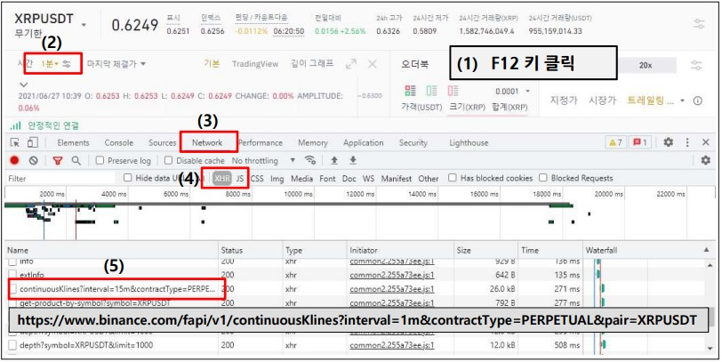
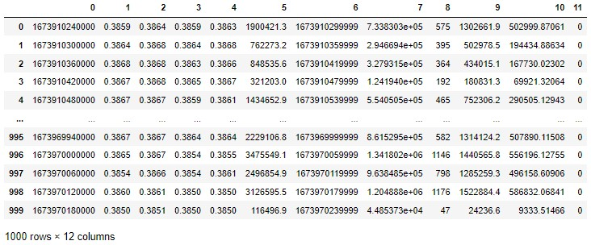
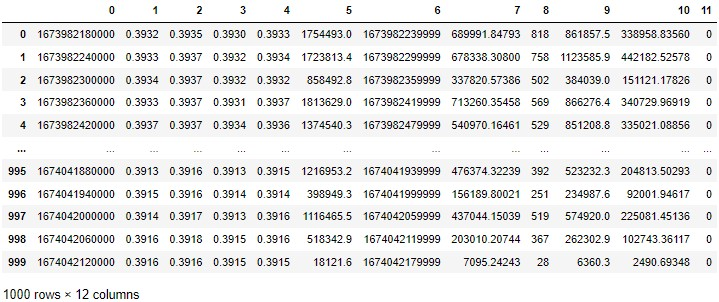

## Table of Contents

- [데이터 수집](#1)
- [Timestamp를 시간으로 변경하기(밀리세컨드)](#2)
- [TA Library(Technical Analysis)](#3)
- [Binance API (ccxt)](#4)

---
## #1

### 데이터 수집
- 크롤링 이용
    - 크롤링을 위하여 크롬 개발자 툴 사용    
            
        - 주소 우클릭후 open in new tap 클릭하여 json 파일 확인해보기
    - XRPUSDT, 1분 데이터 1000개 가져오기
        ```python
        import time
        import datetime
        import pandas as pd
        import requests

        url = 'https://www.binance.com/fapi/v1/continuousKlines?limit=1000&pair=XRPUSDT&contractType=PERPETUAL&interval=1m'
        webpage = requests.get(url)
        webpage.content
        '''
        b'[[1673910120000,"0.3869","0.3873","0.3869","0.3869","828579.2",1673910179999,"320707.42747",370,"422302.6","163468.90759","0"],[1673910180000,"0.3870","0.3872","0.3851","0.3859","8189318.3",1673910239999,"3160034.27121",2537,"2918960.9","1126481.04774","0"], ....]]
        '''
        ```
    - Byte 데이터를 DataFrame으로 읽어오기
        ```python
        import time
        import datetime
        import pandas as pd
        import requests
        from io import BytesIO

        url = 'https://www.binance.com/fapi/v1/continuousKlines?limit=1000&pair=XRPUSDT&contractType=PERPETUAL&interval=1m'
        df = pd.read_json(BytesIO(webpage.content))
        df
        ```    
            

    - startTime을 설정해주면 설정한 기간부터 limit만큼 데이터를 가져올 수 있음
        ```python
        import time
        import datetime
        import pandas as pd
        import requests
        from io import BytesIO

        url = 'https://www.binance.com/fapi/v1/continuousKlines?limit=1000&pair=XRPUSDT&contractType=PERPETUAL&interval=1m&startTime={1673970180000}'
        webpage = requests.get(url)
        df = pd.read_json(BytesIO(webpage.content))
        df
        ```    
            

- ccxt를 이용한 데이터 수집
    - ccxt 는 timestamp를 인자로 받아서 데이터를 출력
    - btc_ohlcv는 timestamp를 반환하고 여기에 pd.to_datetime을 적용하면 UTC가 결과로 나옴. UCT기준 9시간 뒤인 한국시간으로 맞춰주면 됨
        ```python
        import datetime
        import time
        import ccxt 
        import pandas as pd 

        def date_to_timestamp(str_date):

            dt = datetime.datetime.strptime(str_date,'%Y-%m-%d %H:%M:%S')
            ts = time.mktime(dt.timetuple())

            return int(ts*1000)

        binance = ccxt.binanceusdm()
        btc_ohlcv = binance.fetch_ohlcv("BTC/USDT",since=date_to_timestamp('2023-01-17 00:00:00'))

        df = pd.DataFrame(btc_ohlcv, columns=['datetime', 'open', 'high', 'low', 'close', 'volume'])
        df['datetime'] = pd.to_datetime(df['datetime'], unit='ms') + datetime.timedelta(hours = 9)
        df.set_index('datetime', inplace=True)
        print(df)
        '''
                         open      high       low     close     volume
        datetime                                                              
        2023-01-17 00:00:00  20860.68  20873.64  20856.99  20866.07  145.69792
        2023-01-17 00:01:00  20866.66  20883.00  20847.56  20847.88  298.07373
        2023-01-17 00:02:00  20847.88  20850.74  20829.25  20842.63  265.42819
        2023-01-17 00:03:00  20842.63  20856.18  20832.27  20835.33  232.53609
        2023-01-17 00:04:00  20833.84  20849.79  20830.00  20842.51  162.59315
        ...                       ...       ...       ...       ...        ...
        2023-01-17 08:15:00  21139.02  21161.88  21138.04  21157.04   90.56335
        2023-01-17 08:16:00  21155.37  21162.18  21155.37  21160.12   39.09142
        2023-01-17 08:17:00  21160.11  21168.70  21154.58  21161.77  112.85471
        2023-01-17 08:18:00  21162.99  21186.84  21161.77  21176.64  109.72950
        2023-01-17 08:19:00  21176.64  21192.59  21174.97  21189.19   94.53721

        [500 rows x 5 columns]
        '''
        ```    
        - fetch_ohlcv 의 timeframe의 default 값은 1m, limit의 default 값은 500 (변경을 원할경우 `btc_ohlcv = binance.fetch_ohlcv(symbol="BTC/USDT", timeframe='1d', limit=10` 와 같이 입력))
        - 현재 시간보다 미래를 입력하게 되면 btc_ohlcv는 빈 데이터 프레임 반환(아래 코드 동작 시간 2023-01-18 22:10:00. 현재시간보다 먼 미래를 조회했기 때문에 아무것도 나오지 않음)
            ```python
            import ccxt 
            import pandas as pd 


            binance = ccxt.binanceusdm()
            btc_ohlcv = binance.fetch_ohlcv("BTC/USDT",since=date_to_timestamp('2023-01-18 23:00:00'))

            df = pd.DataFrame(btc_ohlcv, columns=['datetime', 'open', 'high', 'low', 'close', 'volume'])
            df['datetime'] = pd.to_datetime(df['datetime'], unit='ms') + datetime.timedelta(hours = 9)
            # to_datetime은 Timestamp가 들어가면 UTC 기준으로 반환해줌 -> timedelta를 이용하여 UTC 기준 9시간 뒤인 한국시간으로 맞춰주기
            df.set_index('datetime', inplace=True)
            print(df)
            '''
            Empty DataFrame
            Columns: [open, high, low, close, volume]
            Index: []
            '''
            ```
- ccxt를 이용해 원하는 기간 데이터 수집하기(data_collect.ipynb)
    ```python
    import datetime
    import time
    import ccxt 
    import pandas as pd 

    def date_to_timestamp(date,utc=False):
        """
        str형태의 date를 timestamp로 만들어주기
        :params (str or datetime) date : '%Y-%m-%d %H:%M:%S'형태의 데이터. ex)'2023-01-18 23:00:00'
        :params bool utc : True로 설정할시에 date를 utc 시간이라고 생각
        :return timestamp시간(단위 ms) ex)1674050400000
        :rtype int
        
        ex) date_to_timestamp('2023-01-18 23:00:00') -> 1674050400000
        """
        if type(date) == str: # str인 경우 datetime으로 변환해주기
            dt = datetime.datetime.strptime(date,'%Y-%m-%d %H:%M:%S')
        else: # datetime으로 들어온경우
            dt = date
            
        # time.mktime은 local 타임 기준으로 timestamp를 변경함. 따라서 utc일 경우 +9시간해서 한국시간으로 설정해줘야함
        if utc:
            dt = date + datetime.timedelta(hours = 9)
        
        ts = time.mktime(dt.timetuple()) 
        
        return int(ts*1000)

    def make_csv_data(coin_name,period,start_time,end_time):
        """
        coin이름, 수집하고 싶은 봉의 기준 기간, 시작, 끝 시간을 지정해주면 그 기간까지의 데이터를 수집하여 csv 파일로 반환
        :params str coin_name : 코인이름 ex)"BTC/USDT"
        :params str period : 수집기준기간 ex) "1m"
        :params str start_time : 수집 시작 시간 ex) '2022-01-01 00:00:00' (한국시간기준)
        :params str end_time : 수집 끝 시간 ex) '2023-01-01 00:00:00' (한국시간기준)
        :return None
        :rtype None
        
        f'{coin_name}_{period}_{start_time}_{end_time}.csv' 파일로 저장됨
        """
        
        # 입력 end_time은 한국시간기준이므로 utc기준으로 변경해주기. pd.to_datetime 이 UTC 시간으로 반환하기때문에 UTC 시간 기준으로 체크를 해줘야함 (UTC에서 KST로 변경은 제일 마지막에 함)
        utc_end_time = datetime.datetime.strptime(end_time,'%Y-%m-%d %H:%M:%S') - datetime.timedelta(hours = 9)
        
        binance = ccxt.binanceusdm()
        btc_ohlcv = binance.fetch_ohlcv(coin_name,period,since=date_to_timestamp(start_time))

        df = pd.DataFrame(btc_ohlcv, columns=['datetime', 'open', 'high', 'low', 'close', 'volume'])
        df['datetime'] = pd.to_datetime(df['datetime'], unit='ms')
        df.set_index('datetime', inplace=True)

        while len(df)==0:  # 정기 점검이 있는 시간대에는 조회를 해도 결과가 나오지 않음. 500개씩 조회되므로 데이터가 조회될때까지 500개씩 건너뛰기
            if 'd' in period:
                start_time=datetime.datetime.strptime(start_time,'%Y-%m-%d %H:%M:%S') + datetime.timedelta(days=int(f"{period[:-1]}*500")) 
            elif 'm' in period:
                start_time=datetime.datetime.strptime(start_time,'%Y-%m-%d %H:%M:%S') + datetime.timedelta(minutes=int(f"{period[:-1]}*500")) 
            else:
                assert False, '일봉과 분봉만 조회 가능합니다.'

            btc_ohlcv = binance.fetch_ohlcv(coin_name,period,since=date_to_timestamp(start_time))

            df=pd.DataFrame(btc_ohlcv,columns=['datetime','open','high','low','close','volume'])
            df['datetime']=pd.to_datetime(df['datetime'],unit='ms')
            df.set_index('datetime',inplace=True)
        
        total_df = df
        
        check_count = 0
        
        while True:
            
            check_count+=1
            if check_count%10 == 0:
                print(total_df.index[-1])
            
            if utc_end_time <= df.index[-1]:
                break
            
            if 'd' in period:
                time_later=df.index[-1] + datetime.timedelta(days=int(f"{period[:-1]}")) 
            elif 'm' in period:
                time_later=df.index[-1] + datetime.timedelta(minutes=int(f"{period[:-1]}")) 
            else:
                assert False, '일봉과 분봉만 조회 가능합니다.'
            
            # pd.to_datetime는 utc기준으로 date를 반환함
            btc_ohlcv = binance.fetch_ohlcv(coin_name,period,since=date_to_timestamp(time_later,utc=True))

            df=pd.DataFrame(btc_ohlcv,columns=['datetime','open','high','low','close','volume'])
            df['datetime']=pd.to_datetime(df['datetime'],unit='ms')
            df.set_index('datetime',inplace=True)
            
            while len(df)==0:  # 정기 점검이 있는 시간대에는 조회를 해도 결과가 나오지 않음. 500개씩 조회되므로 데이터가 조회될때까지 500개씩 건너뛰기
                if 'd' in period:
                    time_later=time_later + datetime.timedelta(days=int(f"{period[:-1]}*500")) 
                elif 'm' in period:
                    time_later=time_later + datetime.timedelta(minutes=int(f"{period[:-1]}*500")) 
                else:
                    assert False, '일봉과 분봉만 조회 가능합니다.'
                
                btc_ohlcv = binance.fetch_ohlcv(coin_name,period,since=date_to_timestamp(time_later,utc=True))

                df=pd.DataFrame(btc_ohlcv,columns=['datetime','open','high','low','close','volume'])
                df['datetime']=pd.to_datetime(df['datetime'],unit='ms')
                df.set_index('datetime',inplace=True)
                
            total_df = pd.concat([total_df,df])
            
        total_df.index = total_df.index + datetime.timedelta(hours = 9)
        total_df = total_df[:end_time]
        
        coin_name = "".join(coin_name.split("/"))
        s_time = "-".join("-".join(str(start_time).split(" ")).split(":"))
        e_time = "_".join("-".join(str(end_time).split(" ")).split(":"))
        total_df.to_csv(f'./{coin_name}_{period}_{s_time}_{e_time}.csv')
    ```
    ```python
    make_csv_data(coin_name= 'BTC/USDT', period= '1m', start_time= '2022-12-01 00:00:00', end_time= '2023-01-01 00:00:00')
    ```

#### References
- https://www.inflearn.com/course/%EB%B9%84%ED%8A%B8%EC%BD%94%EC%9D%B8-%EC%84%A0%EB%AC%BC-%EC%95%8C%EA%B3%A0%EB%A6%AC%EC%A6%98-%ED%8A%B8%EB%A0%88%EC%9D%B4%EB%94%A9/dashboard
- https://wikidocs.net/120392
---

## #2

### Timestamp를 시간으로 변경하기(밀리세컨드)

- timestamp -> date
    ```python
    import datetime
    import pytz

    def timestamp_to_date(mili_time):
        utc_dt = datetime.datetime.utcfromtimestamp(mili_time / 1000.0)
        utc_dt = pytz.utc.localize(utc_dt) # utc_df가 utc시 시간이라는것을 

        korea = pytz.timezone('Asia/Seoul')
        korea_dt = korea.normalize(utc_dt.astimezone(korea))

        timeline = str(korea_dt.strftime('%Y-%m-%d %H:%M:%S'))  #(1) 출력형식 지정
        return timeline

    timestamp_to_date(1673979762000)
    '''
    '2023-01-18 03:22:42'
    '''
    ```
    - 참고 : localize 안한경우(utc시간을 가져왔지만 utc라고 설정하지 않았기때문에 local 피시 시간에 맞춰 utc 시간이 아닌 한국시간으로 생각함. 따라서 한국시간.astimezone(한국존) 이므로 어떠한 시간 변화없이 그 시간 자체가 출력됨 -> 오류)
        ```python
        import datetime
        import pytz

        def timestamp_to_date(mili_time):
            utc_dt = datetime.datetime.utcfromtimestamp(mili_time / 1000.0)
        #     utc_dt = pytz.utc.localize(utc_dt) # utc_df가 utc시 시간이라는것을 

            korea = pytz.timezone('Asia/Seoul')
            korea_dt = korea.normalize(utc_dt.astimezone(korea))

            timeline = str(korea_dt.strftime('%Y-%m-%d %H:%M:%S'))  #(1) 출력형식 지정
            return timeline

        timestamp_to_date(1673979762000)
        '''
        '2023-01-17 18:22:42'
        '''
        ```
    - pandas를 이용할 경우 pd.to_datetime을 통해 timestamp를 utc 시간 기준 datetime으로 바로 변경 가능
        ```python
        df['datetime']=pd.to_datetime(df['datetime'],unit='ms')
        ```
- date -> timestamp 
    ```python
    import datetime
    import time

    def date_to_timestamp(date,utc=False):
        """
        str형태의 date를 timestamp로 만들어주기
        :params (str or datetime) date : '%Y-%m-%d %H:%M:%S'형태의 데이터. ex)'2023-01-18 23:00:00'
        :params bool utc : True로 설정할시에 date를 utc 시간이라고 생각
        :return timestamp시간(단위 ms) ex)1674050400000
        :rtype int
        
        ex) date_to_timestamp('2023-01-18 23:00:00') -> 1674050400000
        """
        if type(date) == str: # str인 경우 datetime으로 변환해주기
            dt = datetime.datetime.strptime(date,'%Y-%m-%d %H:%M:%S')
        else: # datetime으로 들어온경우
            dt = date
            
        # time.mktime은 local 타임 기준으로 timestamp를 변경함. 따라서 utc일 경우 +9시간해서 한국시간으로 설정해줘야함
        if utc:
            dt = date + datetime.timedelta(hours = 9)
        
        ts = time.mktime(dt.timetuple()) 
        
        return int(ts*1000)

    date_to_timestamp('2023-01-18 03:22:42')
    '''
    1673979762000.0
    '''
    ```
    - time 모듈은 로컬 시간으로 date를 자동으로 인식하기 때문에 timestamp로 변경할때 알아서 utc값으로 변경해서 반환해줌
    - print(time.tzname) 를 통해 운영체제나 언어의 시간대 지역을 파악가능
        ```python
        print(time.tzname)
        '''
        ('대한민국 표준시', '대한민국 일광 절약 시간')
        '''
        ```

#### References
- https://github.com/kyungmin1212/Quiz_Study/blob/main/study/1-python.md#22

---

## #3

### TA Library(Technical Analysis)
- https://github.com/bukosabino/ta
- https://technical-analysis-library-in-python.readthedocs.io/en/latest/
- 설치 : `pip install --upgrade ta`
- 단순 이동 평균(Simple Moving Average)
    ```python
    from ta.trend import SMAIndicator

    df['sma7'] = SMAIndicator(df['close'],window=7).sma_indicator()
    df['sma25'] = SMAIndicator(df['close'],window=25).sma_indicator()
    df['sma99'] = SMAIndicator(df['close'],window=99).sma_indicator()
    df.head(10)
    ```
- 가중 이동 평균(Weighted Moving Average)
    ```python
    from ta.trend import WMAIndicator

    df['wma7'] = WMAIndicator(df['close'], window=7).wma()
    df['wma25'] = WMAIndicator(df['close'], window=25).wma()
    df['wma99'] = WMAIndicator(df['close'], window=99).wma()
    df.head(10)
    ```
- 지수 이동 평균(Exponential Moving Average)
    ```python
    from ta.trend import EMAIndicator

    df['ema7'] = EMAIndicator(df['close'], window=7).ema_indicator()
    df['ema25'] = EMAIndicator(df['close'], window=25).ema_indicator()
    df['ema99'] = EMAIndicator(df['close'], window=99).ema_indicator()
    df.head(10)
    ```
- MACD
    - MACD Line : Fast 지수이동평균 - Slow 지수이동평균 (ex. Fast : 12, Slow : 26)
    - Signal Line : MACD Line Sign 지수이동평균 (ex. Sign : 9)
    - Diff Line : MACD Line - Signal Line
    ```python
    from ta.trend import MACD

    macd = MACD(df['close'], window_slow=26, window_fast=12, window_sign=9)
    df['macd'] = macd.macd()
    df['macd_s'] = macd.macd_signal()
    df['macd_d'] = macd.macd_diff()
    df.head(10)
    ```
- RSI
    ```python
    from ta.trend import MACD

    macd = MACD(df['close'], window_slow=26, window_fast=12, window_sign=9)
    df['macd'] = macd.macd()
    df['macd_s'] = macd.macd_signal()
    df['macd_d'] = macd.macd_diff()
    df.head(10)
    ```
- StochRSI 
    - StochRSI : (현시점 RSI - 최저점 RSI) / (최고점 RSI - 최저점 RSI)  (일반적으로 14기간 사용)
    - Smooth K : StochRSI의 이동 평균 기간 (% K 라인)
    - Smooth D : Smooth K의 이동 평균 기간 (% D 라인)
    ```python
    from ta.momentum import StochRSIIndicator

    stochRSI = StochRSIIndicator(df['close'], window=14, smooth1=3, smooth2=3)
    df['srsi'] = stochRSI.stochrsi()
    df['srsik'] = stochRSI.stochrsi_k()
    df['srsid'] = stochRSI.stochrsi_d()
    df.tail(10)
    ```
- Bollinger Bands
    - 상단밴드 : M일 단순 이동 평균(SMA) + (M일 표준편차*N)
    - 중간선 : M일 단순 이동 평균(SMA)
    - 하단밴드 : M일 단순 이동 평균(SMA) - (M일 표준편차*N)
    - M-> window , N-> window_dev
    ```python
    from ta.volatility import BollingerBands

    bb = BollingerBands(df['close'], window=20, window_dev=2)
    df['bh'] = bb.bollinger_hband() #high band
    df['bhi'] = bb.bollinger_hband_indicator() #high band 보다 가격이 높으면 1, 아니면 0
    df['bl'] = bb.bollinger_lband() #low band
    df['bli'] = bb.bollinger_lband_indicator() #low band 보다 가격이 낮으면 1, 아니면 0
    df['bm'] = bb.bollinger_mavg() #middle band
    df['bw'] = bb.bollinger_wband() #band width

    df.tail(10)
    ```
- VWAP
    - VWAP = 시그마(대표가격*거래량) / 시그마(거래량) (시그마 기간이 window 값)
    - 대표가격 : (고가+저가+종가) / 3
    ```python
    from ta.volume import VolumeWeightedAveragePrice

    vwap = VolumeWeightedAveragePrice(high=df['high'], low=df['low'], close=df['close'], volume=df['volume'], window=14)
    df['vwap'] = vwap.volume_weighted_average_price()
    df.tail(10)
    ```
#### References
- https://www.inflearn.com/course/%EB%B9%84%ED%8A%B8%EC%BD%94%EC%9D%B8-%EC%84%A0%EB%AC%BC-%EC%95%8C%EA%B3%A0%EB%A6%AC%EC%A6%98-%ED%8A%B8%EB%A0%88%EC%9D%B4%EB%94%A9/dashboard

---

## #4

### Binance API (ccxt)
- 선물 API 신청한 후 Enable Futures 체크해주기
- ccxt 이용 바이낸스 단순 거래
    - api key 값 세팅
        ```python
        import ccxt

        with open("./api.txt") as f:
            lines = f.readlines()
            api_key = lines[0].strip()
            api_secret = lines[1].strip()

        exchange = ccxt.binanceusdm({
            'apiKey': api_key,
            'secret': api_secret,
        })
        ```

    - 잔고 조회
        ```python
        # 잔고 조회 #
        balance = exchange.fetch_balance()
        usdt_balance = balance['USDT']
        print(usdt_balance)
        total_balance = balance['total']
        print(total_balance)
        total_usdt_balance = balance['total']['USDT']
        print(total_usdt_balance)
        ##########################|
        '''
        {'free': 86.05463201, 'used': 0.0, 'total': 86.05463201}
        {'DOT': 0.0, 'BTC': 0.0, 'SOL': 0.0, 'BNB': 0.0, 'ETH': 0.0, 'ADA': 0.0, 'USDT': 86.05463201, 'XRP': 0.0, 'BUSD': 0.0}
        86.05463201
        '''
        ```
    - 선물 현재가 조회
        - last가 현재가를 의미하는것
        - ask : 매도호가, bid : 매수호가
        ```python
        # 선물 현재가 조회 #
        btc = exchange.fetch_ticker('BTC/USDT')
        pprint.pprint(btc)
        '''
        {'ask': None,
        'askVolume': None,
        'average': 22857.9,
        'baseVolume': 591234.263,
        'bid': None,
        'bidVolume': None,
        'change': 143.6,
        'close': 22929.7,
        'datetime': '2023-01-23T19:13:56.855Z',
        'high': 23193.1,
        'info': {'closeTime': '1674501236855',
                'count': '3407518',
                'firstId': '3220639485',
                'highPrice': '23193.10',
                'lastId': '3224047338',
                'lastPrice': '22929.70',
                'lastQty': '0.001',
                'lowPrice': '22287.00',
                'openPrice': '22786.10',
                'openTime': '1674414780000',
                'priceChange': '143.60',
                'priceChangePercent': '0.630',
                'quoteVolume': '13462002223.45',
                'symbol': 'BTCUSDT',
                'volume': '591234.263',
                'weightedAvgPrice': '22769.32'},
        'last': 22929.7,
        'low': 22287.0,
        'open': 22786.1,
        'percentage': 0.63,
        'previousClose': None,
        'quoteVolume': 13462002223.45,
        'symbol': 'BTC/USDT:USDT',
        'timestamp': 1674501236855,
        'vwap': 22769.32}
        '''
        ```
        ```python
        # 선물 현재가 조회 #
        btc = exchange.fetch_ticker('BTC/USDT')
        print(btc['last'])
        '''
        22912.7
        '''
        ```
    - 선물 OHLCV 조회
        ```python
        # 선물 OHLCV 조회
        btc = exchange.fetch_ohlcv(symbol='BTC/USDT',timeframe='1d',since=None,limit=10)

        df = pd.DataFrame(btc,columns=['datetime','open','high','low','close','volume'])
        df['datetime'] = pd.to_datetime(df['datetime'],unit='ms')
        df.set_index('datetime',inplace=True)
        print(df)
        '''
                       open     high      low    close       volume
        datetime                                                   
        2023-01-14  19924.3  21544.0  19882.6  20962.8  1010666.683
        2023-01-15  20962.8  21073.8  20556.0  20882.7   428486.559
        2023-01-16  20882.7  21498.0  20606.6  21188.3   666148.201
        2023-01-17  21188.2  21640.0  20827.8  21130.9   547390.593
        2023-01-18  21130.8  21672.0  20386.0  20680.0   813785.517
        2023-01-19  20680.1  21183.9  20659.9  21068.3   374733.617
        2023-01-20  21068.3  22750.0  20856.4  22661.1   723645.200
        2023-01-21  22661.0  23390.0  22422.0  22781.9   764681.100
        2023-01-22  22781.8  23080.2  22287.0  22704.6   482529.811
        2023-01-23  22704.7  23193.1  22500.0  22876.0   441291.600
        '''
        ```
    - 선물 오더북(orderbook) 조회
        ```python
        # 선물 오더북 조회 #
        orderbook = exchange.fetch_order_book('BTC/USDT')
        print(orderbook.keys())
        asks = orderbook['asks'] # 매도호가 500개
        bids = orderbook['bids'] # 매수호가 500개
        print(asks[:5])
        print(bids[:5])
        '''
        dict_keys(['symbol', 'bids', 'asks', 'timestamp', 'datetime', 'nonce'])
        [[22855.1, 18.632], [22855.3, 0.123], [22855.4, 3.321], [22855.5, 1.596], [22855.6, 10.416]]
        [[22855.0, 0.079], [22854.9, 0.231], [22854.8, 0.3], [22854.7, 0.009], [22854.6, 0.249]]
        '''
        ```
    - 매수/롱 포지션 진입
        ```python
        order = exchange.create_market_buy_order(
            symbol='BTC/USDT',
            amount=0.001
        )
        print(order)
        ```
    - 매수/롱 포지션 정리
        ```python
        order = exchange.create_market_sell_order(
            symbol='BTC/USDT',
            amount=0.001
        )
        print(order)
        ```
    - 매도/숏 포지션 진입(=매수/롱 포지션 정리)
        ```python
        order = exchange.create_market_sell_order(
            symbol='BTC/USDT',
            amount=0.001
        )
        print(order)
        ```
    - 매도/숏 포지션 정리(=매수/롱 포지션 진입)
        ```python
        order = exchange.create_market_buy_order(
            symbol='BTC/USDT',
            amount=0.001
        )
        print(order)
        ```
    - 레버리지(leverage) 설정
        - 바이낸스 웹페이지에서 교차/격리와 레버리지를 설정한 경우 API에 그대로 적용됨
        - API 사용시 웹페이지에서 교차/격리와 레버리지를 변경하면 해당 설정이 적용되어 버림(주의)(코드가 돌고있을때는 웹페이지에서도 레버리지를 변경하면 안됨!)
        ```python
        #  leverage setting  #
        markets = exchange.load_markets()
        symbol = 'BTC/USDT'
        market = exchange.market(symbol)
        leverage =  5

        response = exchange.fapiPrivate_post_leverage({
            'symbol': market['id'],
            'leverage': leverage,
        })
        print(response)
        '''
        {'symbol': 'BTCUSDT', 'leverage': '5', 'maxNotionalValue': '50000000'}

        '''
        ```
    - 현재 진입한 포지션 정보 얻기
        - 잔고조회에서 positions key 이용
        ```python
        balance = exchange.fetch_balance()
        positions = balance['info']['positions']

        for position in positions:
            if position['symbol']=='BTCUSDT':
                print(position)
        '''
        {'symbol': 'BTCUSDT', 'initialMargin': '23.14650000', 'maintMargin': '0.09258600', 'unrealizedProfit': '-0.00180000', 'positionInitialMargin': '23.14650000', 'openOrderInitialMargin': '0', 'leverage': '1', 'isolated': False, 'entryPrice': '23148.3', 'maxNotional': '5.0E8', 'positionSide': 'BOTH', 'positionAmt': '0.001', 'notional': '23.14650000', 'isolatedWallet': '0', 'updateTime': '1674854889176', 'bidNotional': '0', 'askNotional': '0'}
        '''
        ```
    - 대기 주문 얻어오기
        - 지정가로 주문한경우 미체결 주문(open order=대기 주문)이 존재함
        ```python
        open_orders = exchange.fetch_open_orders(
            symbol='BTC/USDT'
        )
        print(open_orders)
        ```
    - 시장가 주문과 TP/SL(take profit & stop loss)
        ```python
        # 시장가 주문 과 take profig & stop loss #

        symbol = 'BTC/USDT'
        side = 'buy'
        amount = 0.001 # 레버리지가 적용되어서 이 수량만큼 buy or sell 적용
        price = None
        stopLossPrice = 22890
        takeProfitPrice = 22910

        try:
            order = exchange.create_order(symbol, 'MARKET', side, amount)
            print(order)

            inverted_side = 'sell' if side == 'buy' else 'buy'

            stopLossParams = {'stopPrice': stopLossPrice}
            stopLossOrder = exchange.create_order(symbol, 'STOP_MARKET', inverted_side, amount, price, stopLossParams)
            print(stopLossOrder)

            takeProfitParams = {'stopPrice': takeProfitPrice}
            takeProfitOrder = exchange.create_order(symbol, 'TAKE_PROFIT_MARKET', inverted_side, amount, price, takeProfitParams)
            print(takeProfitOrder)

        except Exception as e:
            print(type(e).__name__, str(e))
        ```
    - 지정가 주문과 TP/SL
        - 지정가 주문은 takeprofit 주문이 들어가지지 않게 됨.(주문이 체결될때까지 기다려야하기때문)
        - 또한 price 가격이 현재 가격보다 높은데 buy를 하게되면 바로 체결이 됨(반대로 price 가격이 현재 가격보다 낮은데 sell을 하게 되면 바로 체결이 됨)(내가 구매하고 싶은 가격이 현재 가격보다 바싸거나 싸기때문에 바로 체결이 되는것)
        ```python
        # 지정가 주문 과 take profig & stop loss #

        symbol = 'BTC/USDT'
        side = 'buy'
        amount = 0.001
        price = 22870
        stopLossPrice = 22860
        takeProfitPrice = 22880

        try:
            order = exchange.create_order(symbol, 'LIMIT', side, amount, price)
            print(order)

            inverted_side = 'sell' if side == 'buy' else 'buy'

            stopLossParams = {'stopPrice': stopLossPrice}
            stopLossOrder = exchange.create_order(symbol, 'STOP_MARKET', inverted_side, amount, price, stopLossParams)
            print(stopLossOrder)

            takeProfitParams = {'stopPrice': takeProfitPrice}
            takeProfitOrder = exchange.create_order(symbol, 'TAKE_PROFIT_MARKET', inverted_side, amount, price, takeProfitParams)
            print(takeProfitOrder)

        except Exception as e:
            print(type(e).__name__, str(e))
        ```
    - 바이낸스 주문 취소하기
        - 코드
            ```python
            resp = exchange.cancel_order(
                id=112689802387, # orderId
                symbol='BTC/USDT'
            )
            print(resp)
            ```
        - 스탑로스나 익절 주문이 둘중에 하나라도 판매가 된다면 자동적으로 하나의 주문은 취소 해주어야함.
        - 하나가 체결된다고 다른 주문이 취소되지 않음 
        - 그 가격에 가면 자동으로 취소되긴 하지만 만약에 다른 추가적으로 매수가 들어갔을때 스탑로스나 익절주문이 남아있다면 그 주문 가격으로 체결이 되어버림. 따라서 반드시 내가 주문한 스탑로스나 익절 둘중에 하나라도 체결이 된다면 다른 주문은 취소되도록 만들어줘야함.
    - 스탑로스 코드 작성시 다른 주문이 체결되면 다른 주문은 취소시키기
        - 아래 코드를 응용해서 실매매에 작성하면 됨
        ```python
        symbol = 'BTC/USDT'
        side = 'LONG' # SHORT -> stoploss 가격이 더 높아야함
        amount = 0.001 # 레버리지가 적용되어서 이 수량만큼 buy or sell 적용
        price = None
        stopLossPrice = 23085
        takeProfitPrice = 23095

        # 방어 코드
        if side == 'LONG':
            if stopLossPrice>takeProfitPrice:
                stopLossPrice, takeProfitPrice = takeProfitPrice, stopLossPrice
        elif side == 'SHORT':
            if stopLossPrice<takeProfitPrice:
                stopLossPrice, takeProfitPrice = takeProfitPrice, stopLossPrice

        open_order_list=[]

        try:
            if side == 'LONG':
                
                params = {
                'positionSide': side
                }
                order = exchange.create_market_buy_order(symbol, amount,params)

                params = {
                    'stopPrice': stopLossPrice,
                    'positionSide': side
                }
                stopLossOrder = exchange.create_order(symbol, 'STOP_MARKET', 'sell', amount, price, params)
                print(stopLossOrder)


                params = {
                    'stopPrice': takeProfitPrice,
                    'positionSide': side,
                }

                takeProfitOrder = exchange.create_order(symbol, 'TAKE_PROFIT_MARKET', 'sell', amount, price, params)
                print(takeProfitOrder)
                
                stop_loss_order_id = stopLossOrder['info']['orderId']
                take_profit_order_id = takeProfitOrder['info']['orderId']
                
                open_order_list.append([stop_loss_order_id,take_profit_order_id])
                
            elif side == 'SHORT':
                params = {
                'positionSide': side
                }
                order = exchange.create_market_sell_order(symbol, amount,params)


                params = {
                    'stopPrice': stopLossPrice,
                    'positionSide': side
                }
                stopLossOrder = exchange.create_order(symbol, 'STOP_MARKET', 'buy', amount, price, params)
                print(stopLossOrder)


                params = {
                    'stopPrice': takeProfitPrice,
                    'positionSide': side,
                }

                takeProfitOrder = exchange.create_order(symbol, 'TAKE_PROFIT_MARKET', 'buy', amount, price, params)
                print(takeProfitOrder)
                
                stop_loss_order_id = stopLossOrder['info']['orderId']
                take_profit_order_id = takeProfitOrder['info']['orderId']
                
                open_order_list.append([stop_loss_order_id,take_profit_order_id])

        except Exception as e:
            print(type(e).__name__, str(e))
            
        # 실전 코드가 계속 돌아간다고 가정했을때 

        import time

        while True:
            if not open_order_list:
                break
            
            time.sleep(1)
            
            open_orders = exchange.fetch_open_orders(
                    symbol='BTC/USDT'
                )

            open_orders_id =[order['info']['orderId'] for order in open_orders]

            cancel_id_list=[]
            
            for s,t in open_order_list:
                if s not in open_orders_id: # 체결된 경우
                    cancel_id_list.append(t)
                    open_order_list.remove([s,t])
                    continue
                    
                if t not in open_orders_id: # 체결된 경우
                    cancel_id_list.append(s)
                    open_order_list.remove([s,t])
                    continue
            
            for cancel_id in cancel_id_list:
                resp = exchange.cancel_order(
                    id=cancel_id,
                    symbol='BTC/USDT'
                )
                print('나머지 주문이 취소되었습니다.')
        '''
        {'info': {'orderId': '112705872603', 'symbol': 'BTCUSDT', 'status': 'NEW', 'clientOrderId': 'Y0FtBxRqqdYAcm3xE2KuOG', 'price': '0', 'avgPrice': '0.00000', 'origQty': '0.001', 'executedQty': '0', 'cumQty': '0', 'cumQuote': '0', 'timeInForce': 'GTC', 'type': 'STOP_MARKET', 'reduceOnly': True, 'closePosition': False, 'side': 'SELL', 'positionSide': 'LONG', 'stopPrice': '23085', 'workingType': 'CONTRACT_PRICE', 'priceProtect': False, 'origType': 'STOP_MARKET', 'updateTime': '1674856724529'}, 'id': '112705872603', 'clientOrderId': 'Y0FtBxRqqdYAcm3xE2KuOG', 'timestamp': 1674856724529, 'datetime': '2023-01-27T21:58:44.529Z', 'lastTradeTimestamp': None, 'symbol': 'BTC/USDT:USDT', 'type': 'stop_market', 'timeInForce': 'GTC', 'postOnly': False, 'reduceOnly': True, 'side': 'sell', 'price': None, 'triggerPrice': 23085.0, 'amount': 0.001, 'cost': 0.0, 'average': None, 'filled': 0.0, 'remaining': 0.001, 'status': 'open', 'fee': None, 'trades': [], 'fees': []}
        {'info': {'orderId': '112705873331', 'symbol': 'BTCUSDT', 'status': 'NEW', 'clientOrderId': 'c0defErLP4JbfcjIJtN7Fl', 'price': '0', 'avgPrice': '0.00000', 'origQty': '0.001', 'executedQty': '0', 'cumQty': '0', 'cumQuote': '0', 'timeInForce': 'GTC', 'type': 'TAKE_PROFIT_MARKET', 'reduceOnly': True, 'closePosition': False, 'side': 'SELL', 'positionSide': 'LONG', 'stopPrice': '23095', 'workingType': 'CONTRACT_PRICE', 'priceProtect': False, 'origType': 'TAKE_PROFIT_MARKET', 'updateTime': '1674856724737'}, 'id': '112705873331', 'clientOrderId': 'c0defErLP4JbfcjIJtN7Fl', 'timestamp': 1674856724737, 'datetime': '2023-01-27T21:58:44.737Z', 'lastTradeTimestamp': None, 'symbol': 'BTC/USDT:USDT', 'type': 'take_profit_market', 'timeInForce': 'GTC', 'postOnly': False, 'reduceOnly': True, 'side': 'sell', 'price': None, 'triggerPrice': 23095.0, 'amount': 0.001, 'cost': 0.0, 'average': None, 'filled': 0.0, 'remaining': 0.001, 'status': 'open', 'fee': None, 'trades': [], 'fees': []}
        나머지 주문이 취소되었습니다.
        '''
        ```
    - 양방향 주문(Hedge Mode)
        - 주문창 설정 부분에서 Preference 클릭후 Position Mode를 Hedge Mode로 설정해주어야함
        - 코드가 전체적으로 달라짐. 잔고 조회, 주문 넣는 방식이 모두 변경됨.
        - LONG = 포지션 오픈 : buy, 포지션 클로즈 : sell
        - SHORT = 포지션 오픈 : sell, 포지션 클로즈 : buy
        - 코드
            ```python
            symbol = 'BTC/USDT'
            side = 'LONG' # SHORT -> stoploss 가격이 더 높아야함
            amount = 0.0001 # 레버리지가 적용되어서 이 수량만큼 buy or sell 적용
            price = None
            stopLossPrice = 22900
            takeProfitPrice = 23200

            # 방어 코드
            if side == 'LONG':
                if stopLossPrice>takeProfitPrice:
                    stopLossPrice, takeProfitPrice = takeProfitPrice, stopLossPrice
            elif side == 'SHORT':
                if stopLossPrice<takeProfitPrice:
                    stopLossPrice, takeProfitPrice = takeProfitPrice, stopLossPrice
                    
            try:
                if side == 'LONG':
                    
                    params = {
                    'positionSide': side
                    }
                    order = exchange.create_market_buy_order(symbol, amount,params)

                    params = {
                        'stopPrice': stopLossPrice,
                        'positionSide': side
                    }
                    stopLossOrder = exchange.create_order(symbol, 'STOP_MARKET', 'sell', amount, price, params)
                    print(stopLossOrder)


                    params = {
                        'stopPrice': takeProfitPrice,
                        'positionSide': side,
                    }

                    takeProfitOrder = exchange.create_order(symbol, 'TAKE_PROFIT_MARKET', 'sell', amount, price, params)
                    print(takeProfitOrder)
                    
                elif side == 'SHORT':
                    params = {
                    'positionSide': side
                    }
                    order = exchange.create_market_sell_order(symbol, amount,params)


                    params = {
                        'stopPrice': stopLossPrice,
                        'positionSide': side
                    }
                    stopLossOrder = exchange.create_order(symbol, 'STOP_MARKET', 'buy', amount, price, params)
                    print(stopLossOrder)


                    params = {
                        'stopPrice': takeProfitPrice,
                        'positionSide': side,
                    }

                    takeProfitOrder = exchange.create_order(symbol, 'TAKE_PROFIT_MARKET', 'buy', amount, price, params)
                    print(takeProfitOrder)

            except Exception as e:
                print(type(e).__name__, str(e))
            ```
        - 양방향일때 잔고 얻어오기
            ```python
            balance = exchange.fetch_balance()
            positions = balance['info']['positions']

            for position in positions:
                if position['symbol']=='BTCUSDT' and position['positionSide']=='LONG':
                    print('long',position)
                elif position['symbol']=='BTCUSDT' and position['positionSide']=='SHORT':
                    print('short',position)
            '''
            long {'symbol': 'BTCUSDT', 'initialMargin': '23.15000000', 'maintMargin': '0.09260000', 'unrealizedProfit': '0.00600000', 'positionInitialMargin': '23.15000000', 'openOrderInitialMargin': '0', 'leverage': '1', 'isolated': False, 'entryPrice': '23144.0', 'maxNotional': '5.0E8', 'positionSide': 'LONG', 'positionAmt': '0.001', 'notional': '23.15000000', 'isolatedWallet': '0', 'updateTime': '1674854501402', 'bidNotional': '0', 'askNotional': '0'}
            short {'symbol': 'BTCUSDT', 'initialMargin': '23.15000000', 'maintMargin': '0.09260000', 'unrealizedProfit': '-0.00680000', 'positionInitialMargin': '23.15000000', 'openOrderInitialMargin': '0', 'leverage': '1', 'isolated': False, 'entryPrice': '23143.2', 'maxNotional': '5.0E8', 'positionSide': 'SHORT', 'positionAmt': '-0.001', 'notional': '-23.15000000', 'isolatedWallet': '0', 'updateTime': '1674854494516', 'bidNotional': '0', 'askNotional': '0'}
            '''
            ```
            (차이점은 양방향이 아니라면 positionSide가 BOTH로 나옴)

#### References
- https://wikidocs.net/178885
- https://github.com/ccxt/ccxt/tree/master/examples/py
- https://blog.naver.com/zacra/222662884649

---

## #5

### 잔고 대비 구매 수량 계산하기
- https://www.binance.com/en/trade-rule 에서 USDT Markets의 Minimum Trade Amount 확인
- BTC/USDT 는 0.00001 BTC 이므로 0.00001 미만의 수량은 거래가 진행이 안됨!
- 잔고 대비 10퍼센트 거래하는 함수 예시(leverage를 고려 안함)
    ```python
    import math

    def cal_amount(usdt_balance,cur_price,portion):
        portion = portion
        usdt_trade = usdt_balance * portion
        amount = math.floor((usdt_trade*100000)/cur_price)/100000 # 최소 단위가 0.00001 BTC이므로
        return amount

    # usdt 잔고 조회
    balance = exchange.fetch_balance()
    usdt_balance = balance['total']['USDT']

    # 현재가 조회
    symbol = 'BTC/USDT'
    ticker = exchange.fetch_ticker(symbol)
    cur_price = ticker['last']

    amount = cal_amount(usdt_balance,cur_price,0.1)
    print(usdt_balance)
    print(cur_price)
    print(amount)
    '''
    86.05463201
    22937.2
    0.00037
    '''
    ```
- 잔고 대비 10퍼센트 거래하는 함수 예시(leverage를 고려)
    ```python
    import math

    # 구매 수량 계산
    def cal_amount(usdt_balance,cur_price,portion,leverage):
        """
        거래시점 기준 현재 자산 대비 portion 만큼의 금액을 cur_price에 구매할때 구매량 구하기
        :params float usdt_balance : 현재 시점 usdt_balance
        :params float cur_price : 현재 시점 가격
        :params float portion : 자산대비 구매비율
        :params int leverage : 레버리지(1이상, 1이면 그냥 자기 자산만으로 거래)
        :return amount ex) BTC/USDT라면 0.00346 (단위 BTC)
        :rtype float
        """
        usdt_trade = usdt_balance*leverage * portion
        amount = math.floor((usdt_trade*100000)/cur_price)/100000 # 최소 단위가 0.00001 BTC이므로
        return amount

    # usdt 잔고 조회
    balance = exchange.fetch_balance()
    usdt_balance = balance['total']['USDT']

    # 현재가 조회
    symbol = 'BTC/USDT'
    ticker = exchange.fetch_ticker(symbol)
    cur_price = ticker['last']

    amount = cal_amount(usdt_balance,cur_price,0.1,5)
    print(usdt_balance)
    print(cur_price)
    print(amount)
    '''
    86.05463201
    22967.3
    0.00187
    '''
    ```
#### References
- https://www.binance.com/en/trade-rule
- https://learningspoons.com/course/detail/pythonforfinance/
---

